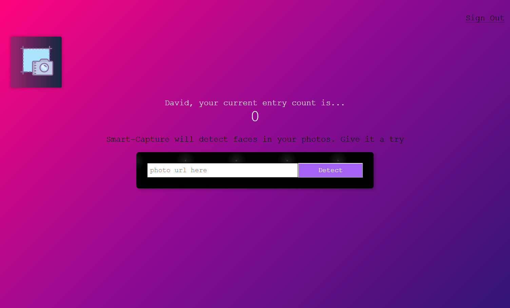
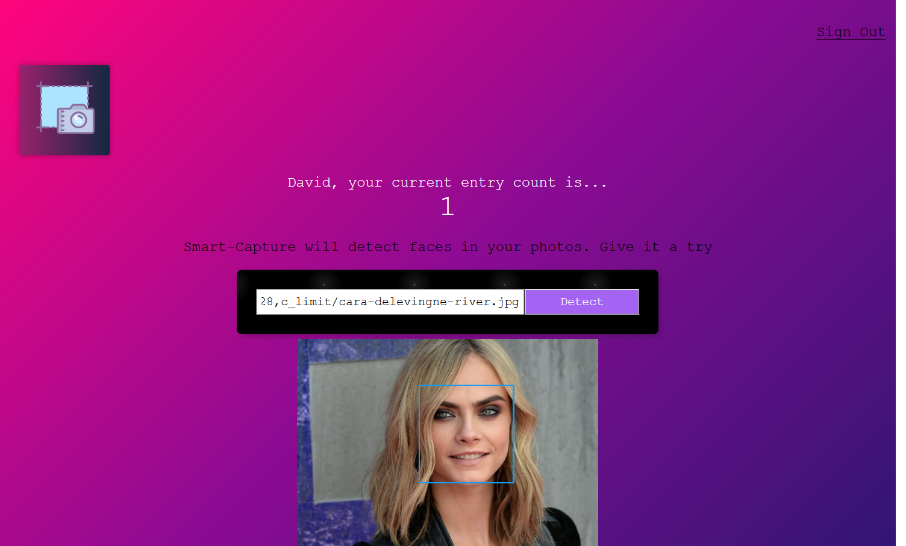

# Smart-Captue

A facial recognition app used to detect faces in photos. 

https://smart-capture.herokuapp.com

Register as a new user to use the app. You can enter in a dummy email and password, so long as you remember it for future use.

Find an image of a person and copy the url of the image to enter into Smart-Capture. Smart-Capture will use vision ai from Clarifai to detect the face in the photo.

